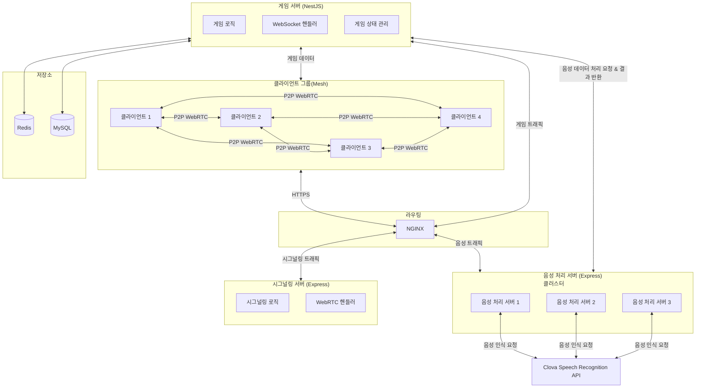

  <h1>안녕! 클로바파트라</h1>

<a href="https://clovapatra.com">서비스 바로가기(https://clovapatra.com)</a>

 

    <a href="https://github.com/orgs/boostcampwm-2024/projects/115/views/1">백로그 </a>
    &nbsp; | &nbsp;
    <a href="https://github.com/boostcampwm-2024/web19-Clovapatra/wiki/Convention">컨벤션</a>
    &nbsp; | &nbsp;
    <a href="https://github.com/boostcampwm-2024/web19-Clovapatra/wiki/Git-Branch-%EC%A0%84%EB%9E%B5">Git Branch 전략</a>
    &nbsp; | &nbsp;
    <a href="#">Figma(준비중)</a> 
    &nbsp; | &nbsp;
    <a href="https://github.com/boostcampwm-2024/web19-boostproject/wiki/%EA%B7%B8%EB%9D%BC%EC%9A%B4%EB%93%9C-%EB%A3%B0">그라운드 룰</a>

 

    

## 📄 목차

- [📄 목차](#-목차)
- [✍🏻 프로젝트 개요](#-프로젝트-개요)
- [🚀 핵심 기능](#-핵심-기능)
- [⚙️ 기술 스택](#️-기술-스택)
- [🏛️ 시스템 아키텍처](#️-시스템-아키텍처)
- [🔎 FE 기술적 도전](#-fe-기술적-도전)
- [🔎 BE 기술적 도전](#-be-기술적-도전)
- [🧡 팀원 소개](#-팀원-소개)

 

## ✍🏻 프로젝트 개요

**안녕! 클로바파트라**는 음성 기반 발음 게임 프로젝트로 사용자들이 발음과 관련된 다양한 도전을 통해 즐거움을 느끼고, 실시간으로 소통할 수 있도록 도와주는 서비스입니다.

사용자들은 음성 인식과 텍스트 변환 기술을 체험하고, 게임을 통해 발음을 개선하며 소통 능력을 향상시키는 경험을 할 수 있습니다.

 

## **🔎 핵심 기능**

### **🎮 멀티 플레이어 게임**

**게임 방 만들기**

> 친구랑 게임하고 싶으세요? 걱정하지 마세요. 방을 하나 만들고 링크만 공유하면 상대방이 쉽게 접속할 수 있고, 처음보는 사람과도 같이 게임을 즐길 수 있도록 개설된 방에 들어갈 수도 있습니다. 사용자들은 직접 방을 개설하고, 다른 사람들을 초대해 실시간으로 소통할 수 있습니다. 닉네임을 지정하여 방에 참여하고, 참가자 목록을 통해 현재 방에 있는 모든 사람을 확인할 수 있습니다.

- 방 개설 및 링크 공유
- 참가자 닉네임 지정 및 실시간 참가자 목록 조회
- 음성 기반의 실시간 통화 지원

### **🎮 안녕! 클로바파트라**

**음성 스트리밍**

> 상대방의 플레이를 숨죽이고 조용히 듣거나, 에베베~ 방해하며 게임에 직접적으로 영향을 줄 수 있습니다. 상대를 최대한 킹받게하세요!

**발음 도전**

> 발음 도전 스테이지는 언제 누가 걸릴지 모릅니다. 목표 문장이 주어지면, 정확하게 발음해야 다음 단계로 진행할 수 있어요. 긴장하세요. 어떤 문장이 나올지 모릅니다.

- **클로바파트라 게임**:
  - 서버 소켓을 통해 사용자별 음성 데이터를 수집하고, 이를 텍스트와 음정으로 변환
- **게임 로직**:

  1. **방 개설 및 참여**

     사용자는 방을 개설하거나 다른 사용자가 개설한 방에 참가할 수 있습니다. 방에 2명 이상의 참가자가 모이면 게임을 시작할 수 있습니다.

  2. **게임 시작 및 순서 설정**

     게임이 시작되면 참가자 순서는 랜덤으로 지정됩니다. 지정된 순서에 따라 참가자들이 차례로 게임에 도전합니다.

  3. **음성 도전 단계**

     참가자는 이전 순서의 사용자보다 높은 음을 내야 성공하며, 실패 시 탈락합니다.

  4. **발음 도전 스테이지**

     게임 중간에 발음 도전 스테이지가 등장할 수 있으며, 이 단계에서는 정확하게 제시된 문장을 발음해야 성공입니다. 실패 시 탈락하게 됩니다.

  5. **게임 종료**

     도전 과정을 거쳐 최종적으로 한 명의 사용자만 남을 때까지 게임이 계속됩니다. 마지막까지 남은 참가자가 승리합니다.

 

## 🏛️ 시스템 아키텍처

 

## 🔎 FE 기술적 도전

### 추가 예정

 

## 🔎 BE 기술적 도전

### 추가 예정

 

## 🧡 팀원 소개

|                                       김태원                                        |                                        정진성                                        |                                       박나현                                       |
| :---------------------------------------------------------------------------------: | :----------------------------------------------------------------------------------: | :--------------------------------------------------------------------------------: |
|  |  |  |
|                                       **BE**                                        |                                        **BE**                                        |                                       **FE**                                       |
|                [@dev-taewon-kim](https://github.com/dev-taewon-kim)                 |                     [@student079](https://github.com/student079)                     |                    [@studioOwol](https://github.com/studioOwol)                    |
